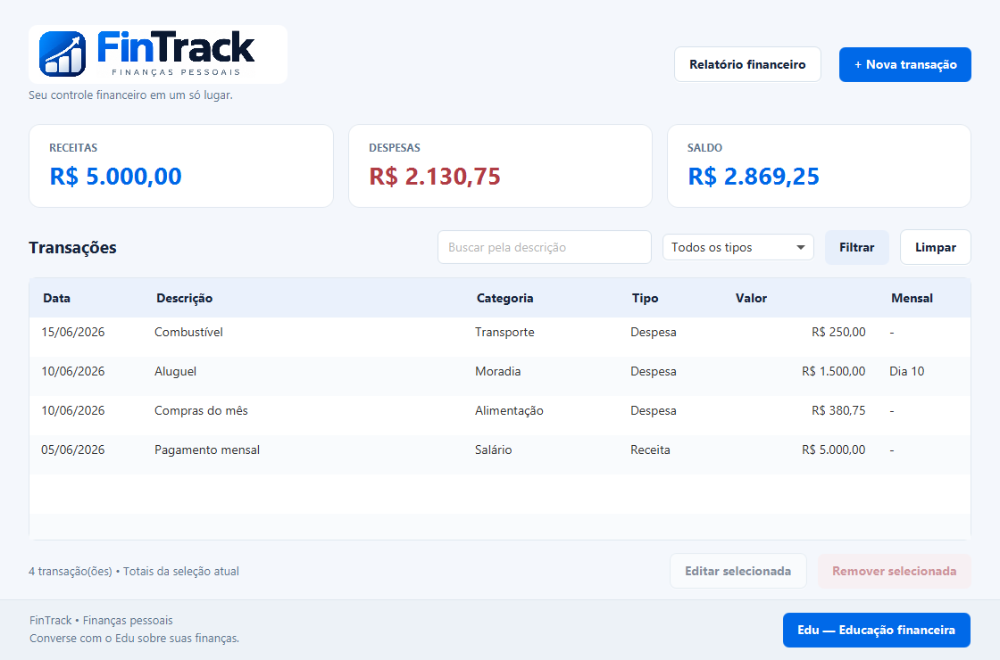

<p align="center">
  
</p>

# FinTrack

Aplicação de finanças pessoais em Java, com interface JavaFX, banco SQLite e o Edu, assistente de educação financeira integrado às transações cadastradas.

O projeto evolui a versão de console para uma aplicação desktop, com FXML, CSS, JDBC, classes genéricas e testes JUnit. A implementação principal e o Edu integrado são escritos em Java, com foco nos conteúdos do curso. O módulo Python é legado e opcional. A identidade visual utiliza a logomarca do FinTrack e uma paleta de azul, azul-marinho e tons claros.

## Conteúdo

- [Funcionalidades](#funcionalidades)
- [Tecnologias e requisitos](#tecnologias-e-requisitos)
- [Instalação e execução](#instalação-e-execução)
- [Como usar](#como-usar)
- [Edu — Educação financeira](#edu--educação-financeira)
- [Proteção da chave Groq](#proteção-da-chave-groq)
- [Banco de dados e migração](#banco-de-dados-e-migração)
- [Arquitetura e organização](#arquitetura-e-organização)
- [Testes](#testes)
- [IDE e Scene Builder](#ide-e-scene-builder)
- [Solução de problemas](#solução-de-problemas)
- [Escopo e limitações](#escopo-e-limitações)

## Funcionalidades

- Cadastro, edição e remoção de receitas e despesas.
- Tabela com data, descrição, categoria, tipo, valor e dia de vencimento mensal.
- Busca pela descrição, filtro por tipo e ordenação das colunas.
- Totais de receitas, despesas e saldo da seleção atual.
- Relatórios por período e categoria, com tabela e gráfico de despesas.
- Validação de campos obrigatórios, datas e valores monetários.
- Persistência local em SQLite e importação única dos registros da versão anterior.
- Conversa com o Edu dentro do aplicativo, com sugestões de assuntos e panorama financeiro.
- Respostas em Markdown, incluindo títulos, negrito, listas, citações, tabelas e código.
- Confirmação da chave Groq por botão ou Enter, com armazenamento criptografado opcional no Windows.
- Consultas ao Edu em segundo plano, com cancelamento e tratamento de falhas.



A captura utiliza registros fictícios dos testes de interface.

## Tecnologias e requisitos

| Tecnologia | Uso |
| --- | --- |
| Java 17 ou superior | Aplicação, modelos, serviços e testes |
| Maven | Dependências, compilação e execução |
| JavaFX 21.0.6 | Controles, FXML e exibição de Markdown com WebView |
| SQLite JDBC 3.49.1.0 | Persistência por JDBC |
| Gson 2.12.1 | Dados JSON nas chamadas à Groq |
| CommonMark 0.30.0 | Conversão de Markdown, com extensão de tabelas |
| JNA 5.18.0 | Integração com a proteção de dados do Windows |
| JUnit 5.12.1 | Testes automatizados |

É necessário um **JDK**, com `java` e `javac`, e o Maven disponível no PATH. As dependências gráficas são obtidas pelo Maven; não é necessário instalar o JavaFX separadamente ou configurar um servidor de banco de dados.

A primeira compilação precisa de internet para baixar dependências. Transações e relatórios funcionam localmente; as respostas do Edu precisam de internet e de uma chave Groq.

Os scripts `.bat` e PowerShell foram preparados para Windows. Em outros sistemas, use Maven com um JDK compatível e ambiente gráfico; o recurso de lembrar a chave está disponível apenas no Windows.

## Instalação e execução

### Clonar esta versão

```powershell
git clone --branch feat/fintrack-javafx-sqlite-edu https://github.com/PedroGiffoni/FinTrack-Capacita.git
cd FinTrack-Capacita
```

### Terminal do VS Code no Windows

Abra a pasta que contém o `pom.xml` da raiz. No terminal PowerShell:

```powershell
.\configurar_projeto.bat
.\rodar_fintrack.bat
```

Também é possível abrir esses arquivos pelo Explorador de Arquivos.

Os scripts procuram um JDK 17 ou superior em JAVA_HOME, no PATH e nas pastas usuais de instalação. Os caminhos do projeto são relativos; não é necessário alterar o código para apontar para outra pasta.

### Comandos PowerShell

```powershell
.\scripts\executar.ps1 -Acao compilar
.\scripts\executar.ps1 -Acao interface
.\scripts\executar.ps1 -Acao testar
```

Os scripts mantêm o cache Maven em `.m2/repository` dentro do projeto. Essa pasta não é versionada.

### Comandos Maven

Com JAVA_HOME e PATH configurados para um JDK compatível:

```text
mvn clean verify
mvn javafx:run
```

Para utilizar o mesmo cache dos scripts:

```powershell
mvn '-Dmaven.repo.local=.m2/repository' javafx:run
```

O comando de compilação produz `target/fintrack-2.0.0.jar`. A execução documentada usa `mvn javafx:run` ou `rodar_fintrack.bat`; o JAR não é um instalador nem inclui todas as dependências.

## Como usar

1. Clique em **+ Nova transação**.
2. Informe descrição, categoria, tipo, valor e data.
3. Se a movimentação for mensal, marque a opção e informe o dia.
4. Salve e confira a tabela e os totais.
5. Selecione uma linha para editar ou remover. A remoção pede confirmação.
6. Utilize a busca e o filtro por tipo para localizar registros.
7. Abra **Relatório financeiro** para filtrar por período e categoria.

Valores devem ser informados sem separador de milhar, por exemplo `1250,50`. O valor deve ser positivo, ter até duas casas decimais e não ultrapassar R$ 99.999.999,99.

As datas usam `dd/MM/yyyy` na interface e formato ISO no banco. A opção mensal guarda um dia entre 1 e 31; ela não gera novas parcelas automaticamente.

## Edu — Educação financeira

Clique em **Edu — Educação financeira** no rodapé da tela principal.

### Configurar a chave

1. Clique em **Criar chave na Groq** para abrir [a página de chaves](https://console.groq.com/keys).
2. Entre ou crie sua conta e selecione **Create API Key**.
3. Copie a chave para o campo **Chave da Groq**.
4. Opcionalmente, marque **Lembrar neste usuário do Windows**.
5. Clique em **Confirmar chave** ou pressione **Enter no campo da chave**.

A confirmação disponibiliza a chave na aplicação. A validade da credencial na Groq é verificada quando uma pergunta é enviada.

### Conversar

- Escreva sua pergunta ou escolha uma sugestão de assunto.
- Use **Enviar pergunta** ou **Ctrl + Enter**.
- Utilize **Cancelar** para interromper a espera.
- Uma falha mantém a pergunta para tentar novamente.
- **Nova conversa** descarta o histórico da sessão.
- **Atualizar panorama** consulta novamente receitas, despesas e saldo.

As respostas seguem as cores do aplicativo e apresentam Markdown formatado. A altura acompanha o conteúdo para permitir a leitura pela rolagem principal da conversa. HTML recebido como texto é escapado; imagens externas e navegação por links dentro das respostas não são habilitadas.

### Integração com as transações

O Edu utiliza o mesmo `TransacaoService` e DAO SQLite do FinTrack. A cada pergunta com **Usar minhas transações** marcado, o aplicativo consulta o banco e envia à Groq:

- Quantidade de registros, receitas, despesas e saldo.
- Despesas agrupadas por categoria.
- Até 100 transações recentes, com descrição, categoria, tipo, data e valor.
- Até 12 mensagens recentes do histórico da conversa, além da pergunta atual.

O panorama e os totais representam **todo o período cadastrado**, e não somente o mês atual.

Ao desmarcar **Usar minhas transações**, uma nova conversa começa sem os registros financeiros e sem o histórico anterior. Dados já enviados à Groq em perguntas anteriores não são retirados pelo aplicativo.

O serviço utiliza o modelo `openai/gpt-oss-20b`. Não há consulta de cotações em tempo real na tela JavaFX. As respostas têm finalidade educativa e não executam operações financeiras.

### Versão anterior em Streamlit

A versão JavaFX do Edu **não depende de Python**. O módulo anterior permanece em `eduIa` para execução independente:

```powershell
.\configurar_edu.bat
.\eduIa\rodar_edu.bat
```

Esse módulo exige Python 3 e as dependências de `eduIa/requirements.txt`. Consulta `FinTrack/dados/fintrack.db`; a variável `FINTRACK_BANCO` permite indicar outro arquivo. Consulte também [o README do módulo](eduIa/README.md).

## Proteção da chave Groq

Por padrão, a chave fica apenas na memória da sessão. A opção de lembrar utiliza **DPAPI no escopo do usuário do Windows**, por meio de JNA.

Ao confirmar com a opção marcada, o aplicativo grava somente o conteúdo criptografado em:

```text
%LOCALAPPDATA%\FinTrack\credenciais\groq.dpapi
```

A credencial não é armazenada no SQLite, no projeto ou no Git. Não é passada por argumentos de terminal.

Na próxima abertura, a tela indica **Chave salva disponível**, mantendo o campo vazio. **Trocar chave** e **Esquecer chave salva** removem a cópia guardada; desmarcar a opção de lembrar também remove a cópia e limpa a credencial da tela.

A proteção distingue contas do Windows. Pessoas que compartilham a mesma conta podem utilizar a chave salva. Não há senha adicional nesta versão; em computador compartilhado, utilize contas separadas ou mantenha a chave somente na sessão.

Se o arquivo não puder ser recuperado, utilize **Esquecer chave salva** e informe uma nova chave. A proteção não substitui os cuidados com a sessão do Windows e com programas executados nela.

## Banco de dados e migração

### Armazenamento

Quando o aplicativo é iniciado na raiz do repositório, o banco fica em:

```text
FinTrack/dados/fintrack.db
```

A pasta e o esquema são criados automaticamente. Uma instalação nova começa sem transações. É possível definir outra pasta pela propriedade Java `fintrack.dados`.

| Coluna de transacoes | Conteúdo |
| --- | --- |
| id | Identificador INTEGER PRIMARY KEY AUTOINCREMENT |
| descricao | Descrição da movimentação |
| valor_centavos | Valor positivo inteiro em centavos |
| tipo | receita ou despesa |
| categoria | Categoria |
| data | Data ISO: yyyy-MM-dd |
| mensal | Indicador de movimentação mensal |
| dia_vencimento | Dia de 1 a 31, ou nulo em movimentações comuns |

O DAO utiliza `PreparedStatement` e `ResultSet`. Valores monetários são armazenados em centavos e calculados com `BigDecimal`, evitando somas com arredondamento de ponto flutuante.

### Migração do CSV antigo

Na primeira execução, se `transacoes.csv` existir na pasta de dados, os registros são importados uma única vez. A importação preserva IDs, categorias, valores, datas e informações mensais.

O lote é validado antes da gravação e utiliza commit/rollback. Se houver falha, o lote não é importado. A tabela `migracoes` registra a conclusão. Depois disso, o CSV não recebe gravações nem é consultado novamente.

Para executar somente a migração:

```powershell
.\scripts\executar.ps1 -Acao migrar
```

O arquivo antigo é mantido localmente e pode ser arquivado depois da conferência. Dados pessoais, banco e CSV de migração ficam fora do versionamento.

### Backup

Feche o FinTrack e copie `fintrack.db` para um local seguro. Para restaurar, com o aplicativo fechado, substitua o arquivo na mesma pasta. A chave Groq não faz parte desse backup e precisa ser configurada separadamente.

## Arquitetura e organização

O fluxo principal é **FXML → controller → serviço → DAO → SQLite**.

| Camada | Responsabilidade |
| --- | --- |
| app | Inicialização JavaFX e entrada antiga de console |
| controller | Eventos, apresentação, formulários e tarefas em segundo plano |
| model | Receitas, despesas, transações mensais e validações |
| repository | Operações genéricas sobre coleções |
| service | Consultas, cálculos, migração, conversa e proteção da chave |
| dao | Conexão JDBC, esquema e CRUD |
| exceptions | Erros da aplicação |
| utils | Formatação monetária e Markdown |
| resources | FXML, CSS e logomarca |
| test | Testes de modelos, serviços, banco e interface |

```text
pom.xml
configurar_projeto.bat
rodar_fintrack.bat
testar_fintrack.bat
configurar_edu.bat
scripts/
    executar.ps1
    configurar_edu.ps1
FinTrack/
    src/
        app/
        controller/
        model/
        repository/
        service/
        dao/
        exceptions/
        utils/
    resources/
        view/
            transacoes.fxml
            transacao-formulario.fxml
            relatorio.fxml
            edu.fxml
        css/fintrack.css
        images/fintrack.png
    test/
    dados/                  Criado localmente
eduIa/                      Módulo anterior em Python
docs/
    requisitos.md
    images/
```

O `RepositorioGenerico<T>` oferece adição, remoção, listagem e filtros. Demonstra `?`, `? extends T` e `? super T` em operações com coleções. O mapeamento dos requisitos desta etapa está em [docs/requisitos.md](docs/requisitos.md). Para estudar o fluxo completo, consulte o [guia de leitura do código](docs/guia-codigo.md), que acompanha os comentários das classes, telas, estilos, scripts e testes.

## Testes

### Testes de regras e persistência

```powershell
.\testar_fintrack.bat
```

Ou:

```text
mvn test
```

### Testes gráficos

Em uma sessão com ambiente gráfico:

```powershell
mvn '-Dmaven.repo.local=.m2/repository' '-Dfintrack.testes.interface=true' verify
```

Os testes abrem janelas temporárias e verificam cadastro, edição, cancelamento, filtros, relatórios, conversa, confirmação da chave, troca, exclusão e Markdown. Capturas são salvas em `target/interface`.

Os testes de DAO usam SQLite em memória ou pastas temporárias. Os testes de DPAPI usam credenciais fictícias e executam somente no Windows. As chamadas à Groq são simuladas por servidor local ou serviço de teste, sem chave real ou consumo de créditos. O banco pessoal não é alterado.

### Módulo Streamlit opcional

Após configurar o ambiente Python:

```powershell
.\eduIa\.venv\Scripts\python.exe -m unittest discover -s eduIa/test
mvn '-Dfintrack.testes.edu=true' '-Dtest=EduIntegrationTest' test
```

O segundo comando testa a inicialização e o encerramento do servidor Streamlit local. Esse teste fica desabilitado nas execuções comuns.

## IDE e Scene Builder

Abra a raiz do repositório, que contém o `pom.xml`, no VS Code, NetBeans ou IntelliJ IDEA com suporte a Maven. Os arquivos Ant da etapa inicial permanecem como referência; a compilação atual usa o Maven da raiz.

Os arquivos de `FinTrack/resources/view` utilizam `fx:controller` e controles JavaFX padrão e podem ser abertos no Scene Builder. A folha de estilo comum fica em `FinTrack/resources/css/fintrack.css`. O componente que exibe Markdown é criado pelo controller durante a conversa.

## Solução de problemas

| Sintoma | Verificação |
| --- | --- |
| JDK incompatível ou javac ausente | Instale JDK 17 ou superior; confira JAVA_HOME e `java --version` |
| mvn não encontrado | Instale Maven e adicione sua pasta bin ao PATH |
| Falha ao baixar dependências | Confira a conexão e execute novamente a configuração |
| PowerShell bloqueia o script | Use o arquivo .bat correspondente, que configura a execução do script |
| Chave digitada sem confirmação | Clique em Confirmar chave ou pressione Enter no campo da chave |
| Chave recusada | Confira ou substitua a chave no painel da Groq |
| Limite de uso atingido | Aguarde e consulte os limites da sua conta Groq |
| Chave salva não pode ser aberta | Use Esquecer chave salva e configure novamente nesta conta do Windows |
| Nenhuma transação na instalação nova | Cadastre os registros ou importe o CSV antigo antes da primeira migração |
| Banco ocupado | Feche outras instâncias ou programas que estejam mantendo o arquivo aberto |

Avisos de acesso nativo ou de APIs antigas podem aparecer com JDKs recentes. Eles devem ser diferenciados de uma falha de compilação ou de execução; confira o resultado do comando e a mensagem final.

## Escopo e limitações

Esta etapa não inclui login de usuários do FinTrack, sincronização entre dispositivos, servidor de banco, geração automática de parcelas, instalador desktop ou cotação financeira em tempo real na tela JavaFX.

As transações são locais, e a chave salva é vinculada à conta do Windows. O compartilhamento do banco entre pessoas não cria perfis separados dentro da aplicação.

## Referências

- [JavaFX](https://openjfx.io/openjfx-docs/)
- [SQLite JDBC](https://github.com/xerial/sqlite-jdbc)
- [JUnit](https://junit.org/junit5/)
- [CommonMark para Java](https://github.com/commonmark/commonmark-java)
- [Groq](https://console.groq.com/docs)
- [Proteção de dados do Windows](https://learn.microsoft.com/pt-br/windows/win32/api/dpapi/nf-dpapi-cryptprotectdata)

## Autor

Pedro Giffoni. Projeto desenvolvido para fins acadêmicos e educacionais.
