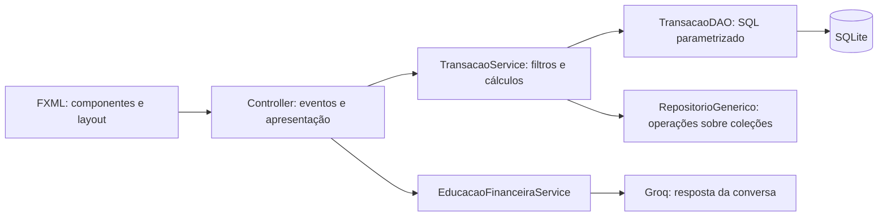

# Guia de leitura do código

Este guia acompanha os comentários dos arquivos e organiza a leitura da aplicação por responsabilidade. A entrada atual é `app.FinApp`; `app.Main` mantém a versão de console como referência da etapa inicial.

## Ordem sugerida para estudar

1. [Modelos](../FinTrack/src/model/Transacao.java): dados, validação, herança e impacto no saldo.
2. [Repositório genérico](../FinTrack/src/repository/RepositorioGenerico.java): coleções e curingas.
3. [Conexão](../FinTrack/src/dao/Conexao.java) e [DAO](../FinTrack/src/dao/TransacaoDAO.java): JDBC e SQL.
4. [Serviço financeiro](../FinTrack/src/service/TransacaoService.java): filtros, totais e agrupamentos.
5. [Inicialização](../FinTrack/src/app/FinApp.java): montagem das dependências.
6. [FXML](../FinTrack/resources/view/transacoes.fxml) e [controller principal](../FinTrack/src/controller/TransacoesController.java): interação com as telas.
7. [Edu](../FinTrack/src/controller/EduController.java): trabalho assíncrono, credencial e contexto.
8. [Testes](../FinTrack/test): exemplos executáveis de comportamentos e falhas.

## 1. Como os arquivos se conectam

O controller conhece os controles, mas não escreve SQL. O DAO conhece SQL, mas não abre caixas de diálogo. O serviço recebe objetos e coordena regras que podem ser verificadas sem uma janela aberta.

A aplicação utiliza JDBC diretamente. Não há camada de ORM nem servidor de banco.

## 2. Modelos: o que é uma transação

### Transacao

A classe base reúne identificador, categoria, descrição, valor, tipo e data.

Os setters são usados também pelos construtores. Assim, criar um objeto e alterar seus atributos passam pelas mesmas regras. Uma atribuição só ocorre depois da validação; uma alteração inválida não deve substituir o valor anterior.

O campo `valor` continua como double para compatibilidade com a versão de console. Os cálculos atuais usam `getValorDecimal()`, que devolve BigDecimal com duas casas decimais.

`BigDecimal.valueOf(valor)` utiliza a representação decimal do número recebido. `RoundingMode.UNNECESSARY` exige que o valor possa ter duas casas sem arredondamento; 10,001, por exemplo, é rejeitado.

`calcularImpactoDecimal()` devolve receitas positivas e despesas negativas. O saldo é a soma desses impactos.

Datas recebidas no formato brasileiro ou ISO são convertidas para LocalDate e apresentadas como dd/MM/yyyy. O formato usa uuuu e resolução estrita: uma data impossível não é ajustada silenciosamente.

O contador estático cria identificadores provisórios em memória. Depois de uma inserção, o DAO substitui o ID do objeto pelo valor gerado no SQLite. Portanto, o banco controla os identificadores persistidos.

### Receita e Despesa

As subclasses fixam o tipo no construtor e reutilizam os atributos e validações de Transacao. Elas demonstram herança sem repetir os campos comuns.

Uma lista de Transacao pode conter instâncias das duas subclasses. O código consulta os atributos comuns sem precisar de uma lista separada para cada tipo.

### TransacaoMensal

Acrescenta `diaVencimento`, limitado a 1–31. Ao reconstruir um registro do banco, seu construtor também recebe o ID original.

A recorrência representa uma informação de vencimento, não uma rotina de geração de parcelas. O dia 31 pode ser cadastrado independentemente do mês da movimentação, pois é um dia previsto de recorrência.

## 3. Generics e curingas

`RepositorioGenerico<T>` trabalha com um tipo definido pelo chamador. Na aplicação financeira, T é Transacao; nos testes, a mesma classe também recebe String e Integer.

| Assinatura | Significado no projeto |
| --- | --- |
| adicionar(T) | Inclui um elemento do tipo definido |
| adicionarTodos(Collection&lt;? extends T&gt;) | Lê elementos de T ou de suas subclasses |
| filtrar(Predicate&lt;? super T&gt;) | Aceita um critério capaz de avaliar T ou um supertipo |
| copiarPara(Collection&lt;? super T&gt;) | Escreve elementos em uma coleção de T ou de um supertipo |
| contar(Collection&lt;?&gt;) | Conta sem precisar saber o tipo dos elementos |

Antes de adicionar um lote, todos os elementos são verificados contra null. Isso evita incluir os primeiros registros e falhar somente ao encontrar um elemento inválido depois.

`List.copyOf` protege a estrutura da coleção retornada: o chamador não pode adicionar ou remover por essa lista. Os objetos nela contidos continuam sendo os mesmos objetos, e não cópias profundas. Essa distinção explica por que o formulário de edição constrói uma nova transação.

O repositório genérico atua em memória. Quem persiste registros é o DAO.

### Serviço genérico

`ServicoGenerico<T>` define um contrato reutilizável de cadastro, remoção, listagem e filtro. `TransacaoService extends ServicoGenerico<Transacao>` mantém as operações SQL no DAO e fornece a consulta atual por `consultar()`.

O serviço base implementa `listar()` e `filtrar(Predicate<? super T>)` usando um novo repositório para cada consulta. `consultar()` aceita `Collection<? extends T>`, permitindo uma fonte de subtipos. A lista retornada protege sua estrutura, mas não é uma cópia profunda dos objetos.

O filtro financeiro com descrição, tipo, categoria e datas usa o filtro genérico herdado. As telas e o Edu passam pelo mesmo serviço; nenhuma consulta depende de registros antigos mantidos em cache. A especialização também implementa `adicionar(Transacao)` e `remover(int)`, exercitados pelos testes através de uma referência `ServicoGenerico<Transacao>`.

## 4. JDBC: abrir e configurar o banco

`Conexao.pastaDados()` primeiro verifica a propriedade `fintrack.dados`. Sem configuração, considera o diretório de execução e escolhe a pasta local prevista no projeto.

`Conexao.abrir()` cria a pasta, monta a URL `jdbc:sqlite:...` e chama a versão que recebe uma URL. Essa segunda assinatura permite usar `jdbc:sqlite::memory:` nos testes.

O DriverManager seleciona o driver pela URL. Após abrir:

- `busy_timeout = 5000` permite esperar até cinco segundos por um bloqueio.
- `foreign_keys = ON` habilita a validação de relacionamentos nesta conexão.

Se a configuração falhar, a conexão é fechada antes de propagar o erro.

## 5. DAO: de objetos para linhas SQL

O construtor de TransacaoDAO recebe uma conexão e cria as tabelas se elas ainda não existirem.

### Inserir

1. Prepara o INSERT com parâmetros.
2. `preencher()` associa os sete atributos persistidos.
3. `executeUpdate()` realiza a gravação.
4. `last_insert_rowid()` consulta o ID gerado na mesma conexão.
5. O ID definitivo é colocado no objeto.

Os índices de parâmetros JDBC começam em 1. Os dados do usuário não são concatenados à instrução SQL. Uma descrição contendo palavras de SQL continua sendo um valor de coluna.

### Atualizar e remover

O UPDATE usa o oitavo parâmetro para o ID do WHERE. O DELETE usa um único parâmetro.

Ambos verificam a quantidade de linhas afetadas. Zero significa que o registro não foi encontrado. O serviço transforma esse resultado em uma orientação adequada para a interface.

### Consultar

O SELECT ordena por data ISO e ID, em ordem decrescente. A ordenação ISO funciona cronologicamente porque ano, mês e dia aparecem do maior intervalo para o menor.

O ResultSet mantém um cursor. Cada chamada a `next()` avança para outra linha. `ler()` reconstrói TransacaoMensal, Receita ou Despesa conforme os campos persistidos.

### Dinheiro em centavos

Na gravação, `movePointRight(2)` transforma reais em centavos e `longValueExact()` impede truncamento. Na leitura, a escala 2 transforma o inteiro novamente em reais.

O agrupamento e a soma usam BigDecimal. A conversão para double no gráfico é apenas de apresentação, depois de os totais financeiros terem sido calculados.

### Recursos e erros

PreparedStatement, Statement e ResultSet ficam em try-with-resources. O Java chama close ao sair do bloco, inclusive em falhas.

O próprio DAO implementa AutoCloseable. Sua conexão permanece aberta durante a sessão e é fechada ao encerrar a aplicação.

PersistenciaException é uma RuntimeException que mantém a causa técnica. Os controllers podem apresentar a mensagem do domínio enquanto o diagnóstico preserva a falha do driver.

## 6. Migração: por que não grava parcialmente

MigracaoDados é a única rotina Java que lê o CSV antigo. A persistência normal não utiliza CSV.

Primeiro consulta o marcador `transacoes_csv`. Se estiver concluído, retorna antes de acessar o arquivo.

Sem marcador, lê todas as linhas e valida número de campos, IDs, duplicatas, tipo, valor, data e recorrência. O limite -1 do split mantém campos vazios no fim da linha, importantes para conferir o formato.

Somente depois de validar o lote inteiro chama `dao.importar()`.

No DAO, `setAutoCommit(false)` faz o lote e o marcador pertencerem à mesma transação. Commit confirma os dois. Se uma inserção falhar, rollback desfaz todas, inclusive as anteriores à falha. Finally restaura o commit automático.

Sem arquivo antigo, o lote vazio também conclui a migração. Por isso uma base antiga deve ser colocada na pasta antes da primeira migração.

## 7. Serviço: filtro e cálculo

TransacaoService recebe o DAO por construtor. Cada consulta relê os registros persistidos.

O filtro combina descrição, tipo, categoria e limites opcionais de data. Todos os critérios definidos precisam ser atendidos. null significa ausência de restrição.

As datas inicial e final são inclusivas. O serviço rejeita um período em que o início é posterior ao fim.

`calcularSaldo()` soma impactos. `calcularTotal()` seleciona um tipo e soma valores positivos. `despesasPorCategoria()` utiliza TreeMap com comparação sem distinguir maiúsculas, agrupando Moradia e moradia.

## 8. JavaFX: inicialização e telas

FinApp.start abre o DAO, executa a migração e carrega transacoes.fxml pelo FXMLLoader. O fx:controller identifica qual classe receberá os campos @FXML.

O FXMLLoader cria os controles e chama initialize. Só depois FinApp fornece o serviço pelo método configurar. Essa ordem evita que o controller consulte uma dependência ainda ausente durante sua criação.

A Scene reúne os componentes e a folha CSS. O Stage representa a janela. FinApp.stop fecha a janela do Edu, cancela sua consulta e encerra a conexão.

### Tela principal

TransacoesController cria as associações das colunas por cellValueFactory. Essas funções extraem o atributo de cada objeto da linha.

Os comparadores de data e valor usam seus significados reais, em vez de ordenar datas e moedas como texto.

As propriedades de edição e remoção ficam vinculadas à seleção da tabela. Sem linha selecionada, os botões ficam desabilitados.

Cada consulta troca os itens da tabela e recalcula totais sobre a mesma seleção. Portanto, filtrar também muda o resumo apresentado.

### Formulário

TransacaoController confirma o texto pendente do DatePicker com commitValue. O fato de o usuário ter digitado sem abrir o calendário não elimina a validação.

O valor aceita dígitos e até duas casas com ponto ou vírgula; não aceita separador de milhar.

Na edição, cria outro objeto e reutiliza o ID original somente na gravação. Cancelar não altera parcialmente a instância anterior. O sinal salvo informa ao controller principal se precisa recarregar a tabela.

### Relatório

RelatorioController busca categorias existentes no banco, aplica período e categoria, calcula totais e monta tabela e gráfico a partir do mesmo conjunto.

O gráfico considera somente despesas. Um conjunto sem despesas pode ter receitas e saldo sem apresentar fatias.

## 9. FXML, CSS e identidade visual

Os comentários FXML explicam os containers e os controles:

- BorderPane divide a tela em regiões.
- VBox organiza verticalmente e HBox horizontalmente.
- GridPane usa linhas e colunas para alinhar os campos.
- Region com crescimento ocupa espaço flexível.
- ScrollPane permite leitura quando o conteúdo excede a janela.

fx:id deve coincidir com o campo @FXML. styleClass faz a ligação com o CSS. O layout fica separado dos eventos e das regras financeiras.

A logomarca é um recurso empacotado no classpath. ImageView usa viewport para mostrar as partes necessárias da imagem original sem alterar o arquivo.

No CSS, classes de aparência são reaproveitadas por todas as telas. Os comentários diferenciam cor de marca, estado positivo, estado negativo, erro, foco e seleção.

## 10. Edu: da chave à resposta

EduController recebe o mesmo TransacaoService usado pela tela principal. O panorama e o contexto não dependem de um arquivo de exportação.

### Credencial

Confirmar chave e Enter no campo utilizam confirmarCredencial. Essa etapa aceita a credencial localmente e pode salvar sua cópia criptografada. Não chama a Groq para verificar a validade; a verificação acontece no envio de uma pergunta.

Uma credencial recuperada permanece no estado da sessão; o PasswordField continua vazio. Trocar, esquecer e desmarcar a opção de lembrar retiram a cópia armazenada.

### Consentimento e histórico

Antes de uma consulta, o controller captura pergunta, chave, consentimento e uma cópia do histórico. Se autorizado, consulta novamente o SQLite e usa esse mesmo conjunto para atualizar o panorama.

Mudar Usar minhas transações limpa a conversa. Isso evita que a conversa seguinte continue com o histórico que já continha dados financeiros.

### Concorrência

Uma chamada HTTP pode bloquear a thread que a executa. Task.call roda em uma thread separada. Os callbacks de sucesso, falha e cancelamento são executados no thread JavaFX e podem alterar controles.

Enquanto a Task está ativa, campos e ações que mudariam o contexto ficam bloqueados. Cancelar solicita a interrupção, restaura a pergunta e libera a tela.

A thread é daemon para não impedir a JVM de encerrar. Isso não substitui o cancelamento explícito realizado ao fechar a janela.

### Pedido HTTP

EducacaoFinanceiraService cria JSON com instruções, contexto, histórico e pergunta em papéis separados.

O resumo considera todos os registros; os detalhes ficam limitados a 100 transações recentes. Até 12 mensagens anteriores acompanham a pergunta atual.

A credencial vai no cabeçalho Authorization por HTTPS. Não vai na URL nem no corpo do histórico.

O serviço diferencia credencial recusada, limite de uso, falha de conexão e resposta sem conteúdo válido. Falhas não entram no histórico como se fossem respostas do educador.

## 11. Markdown e WebView

MarkdownFormatador interpreta o texto com CommonMark e a extensão de tabelas. Isso produz uma árvore de nós, posteriormente convertida em HTML.

Antes da conversão, imagens são retiradas. HTML recebido é escapado, e links são apresentados sem href. A política de conteúdo bloqueia recursos externos e permite apenas o estilo local.

O WebView recebe HTML produzido pelo aplicativo. Depois de carregar, uma expressão fixa mede a altura do conteúdo. Uma alteração de largura também exige nova medição porque muda a quantidade de linhas.

A rolagem principal passa a cuidar da resposta inteira. A pergunta do usuário continua sendo apresentada como texto simples.

## 12. DPAPI e armazenamento da chave

ChaveGroqService localiza o arquivo no perfil atual, fora do projeto. A disponibilidade exige Windows e um caminho de armazenamento válido.

A criptografia utiliza UI_FORBIDDEN e não utiliza LOCAL_MACHINE. Assim, a operação fica vinculada à conta do Windows e não abre diálogos nativos inesperados.

Primeiro criptografa em memória. Depois grava somente o conteúdo cifrado em um temporário, substituindo o arquivo final. Quando disponível, a movimentação atômica evita uma substituição parcial.

Os buffers de bytes são zerados ao terminar. Strings Java são imutáveis e não podem ser zeradas; limpar uma referência não garante apagar todas as cópias da memória. Por isso o código evita logs, banco, argumentos de terminal e apresentação da credencial.

A proteção distingue contas do Windows, não pessoas que compartilham uma mesma conta. Esta versão não possui senha adicional nem login próprio do FinTrack.

## 13. Versões anteriores

Main e FinTracker mostram o fluxo do console. FinTracker agora consulta o SQLite pelo mesmo serviço, mas mantém a apresentação antiga e métodos compatíveis.

EduService inicia somente a versão anterior em Streamlit, utilizada pelo console ou pelo teste de integração opcional. A tela JavaFX não chama esse servidor para responder perguntas.

No Python, carregar_bases abre o SQLite em modo somente leitura e transforma o resultado em DataFrame. As bases opcionais de perfil, produtos e histórico pertencem apenas à versão antiga do módulo.

## 14. Scripts e Maven

O pom.xml define as pastas de código, recursos e testes, as dependências e os plugins.

executar.ps1 seleciona o JDK e a ação desejada. A consulta de versão captura saída normal e erro separadamente: mensagens informativas de JAVA_TOOL_OPTIONS no stderr não devem ser confundidas com falha do Java.

Os arquivos .bat mantêm caminhos relativos com %~dp0 e encaminham a ação ao PowerShell. configurar_edu.ps1 é necessário somente para a versão Python.

## 15. Como ler os testes

Cada teste pode ser lido em três etapas: preparar dados e dependências; executar uma operação; conferir o resultado.

| Teste | O que demonstra |
| --- | --- |
| TransacaoTest | Validação, normalização e impacto de receitas e despesas |
| RepositorioGenericoTest | Tipos genéricos, lista protegida e rejeição de lote com null |
| TransacaoDAOTest | CRUD, IDs, subclasses, SQL parametrizado e rollback |
| MigracaoDadosTest | Importação única, falha sem lote parcial e persistência em arquivo |
| TransacaoServiceTest | Contrato genérico com SQLite, leitura atualizada, predicado de supertipo, soma decimal, filtros inclusivos e categorias equivalentes |
| EducacaoFinanceiraServiceTest | Pedido HTTP, contexto autorizado e credencial recusada |
| ChaveGroqServiceTest | Criptografia, recuperação, substituição, exclusão e arquivo inválido |
| MarkdownFormatadorTest | Elementos formatados e rejeição de conteúdo ativo ou externo |
| InterfaceTest | Eventos reais de controles, tarefas, chave e apresentação Markdown |
| EduServiceTest / EduIntegrationTest | Inicialização e encerramento do servidor legado |
| eduIa/test/test_app.py | Consulta SQL e interface Streamlit com provedor simulado |

BeforeEach cria dependências novas por cenário; AfterEach fecha os recursos. TempDir separa arquivos de teste dos arquivos pessoais.

Os testes gráficos precisam executar as ações no thread JavaFX. FutureTask e CompletableFuture coordenam callbacks sem bloquear esse thread. Os limites de espera impedem um teste travado indefinidamente.

As chaves usadas em testes são fictícias. Um servidor HTTP local ou um serviço substituto fornece as respostas, evitando chamadas reais à Groq.

## 16. Revisão e limites da etapa

A aplicação mantém uma conexão SQLite na sessão. Consultas financeiras partem da interface; a tarefa de rede recebe uma fotografia dos dados e não consulta a conexão JDBC em paralelo.

O banco local não implementa perfis separados de usuários. O arquivo pertence à instalação, e a proteção da chave pertence à conta do sistema operacional. Esses dois limites são distintos.

A entrega não inclui sincronização, login próprio, geração de parcelas ou instalador com dependências embarcadas. A entrada de execução documentada continua sendo o Maven ou o script do projeto.

## Foco do curso de Java

A aplicação principal funciona inteiramente em Java. O cadastro e os relatórios exercitam orientação a objetos, herança, encapsulamento, coleções, generics, exceções e JDBC. As telas usam JavaFX, FXML e eventos. O Edu nativo exercita HTTP, JSON, tarefas assíncronas e integração com serviços externos, também em Java. O módulo Streamlit é mantido apenas como legado opcional e não é requisito para executar o aplicativo ou o Edu integrado.
