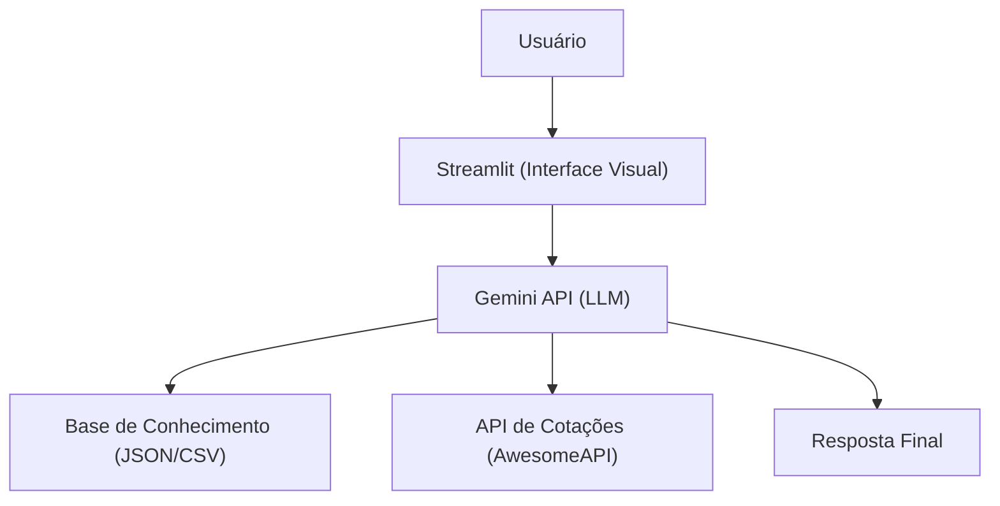

# Documentação do Agente — EDU (Versão Atualizada)

## Caso de Uso

### Problema

Muitas pessoas têm dificuldade em entender conceitos básicos de finanças pessoais, como orçamento, reserva de emergência, juros, câmbio e tipos de investimentos.

### Solução

O Edu é um agente educativo que explica conceitos financeiros de forma simples e clara, usando os dados do próprio cliente como exemplo.  
Ele também pode fornecer cotações reais de moedas (como dólar, euro e bitcoin), pois recebe esses dados de uma API externa.

### Público-Alvo

Pessoas iniciantes em finanças pessoais que querem aprender a organizar suas finanças e entender melhor o impacto de decisões financeiras no dia a dia.

---

## Persona e Tom de Voz

### Nome do Agente

Edu (Educador Financeiro)

### Personalidade

- Educativo e paciente
- Didático e acessível
- Nunca julga o usuário
- Começa direto no conteúdo

### Tom de Comunicação

Informal, acessível e direto, como um professor particular que explica de forma simples.

### Exemplos de Linguagem

- Explicação: “Vamos entender isso de um jeito simples.”
- Complemento: “Se quiser, posso te mostrar como isso afeta suas finanças.”
- Limitação: “Não posso recomendar investimentos específicos, mas posso explicar como funcionam.”

---

## Arquitetura

### Diagrama

### Componentes

| Componente           | Descrição                                                  |
| -------------------- | ---------------------------------------------------------- |
| Interface            | [Streamlit](https://streamlit.io/)                         |
| LLM                  | Gemini 2.5 flash (google AI)                               |
| Base de Conhecimento | JSON/CSV mockados na pasta `data`                          |
| API de Cotações      | [AwesomeAPI](https://docs.awesomeapi.com.br/api-de-moedas) |

---

## Segurança e Anti-Alucinação

### Estratégias Adotadas

- [x] Responde a cotações de moedas utilizando api externa, evitando inventar dados
- [x] Não inventa dados que não vieram da API
- [x] Não recomenda investimentos específicos
- [x] Admite quando não sabe algo
- [x] Foca em educar, não em aconselhar

### Limitações Declaradas

> O que o agente NÃO faz?

- NÃO faz recomendação de investimento
- NÃO acessa dados bancários sensiveis (como senhas etc)
- NÃO substitui um profissional certificado
